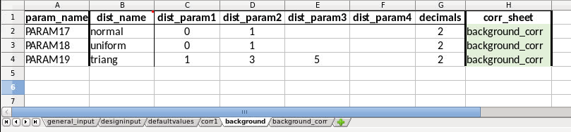
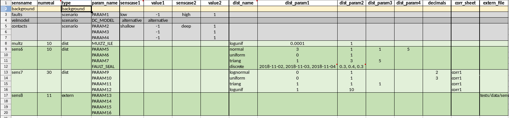
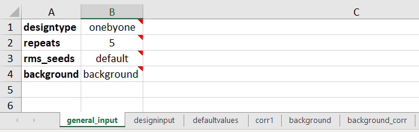

======================
Examples to learn from
======================

.. Notice that YAML files included are also input to testing
   and this secures consistency, except excel spreadsheet which are images.

-------------------------------------------------
Create design matrix for one by one sensitivities
-------------------------------------------------

These examples show use of the ``fmu.tools.sensitivities`` package to
generate design matrices automatically. Input is given as a dictionary
which can be generated from an excel workbook. The excel workbook must
be set up using a specific format. These examples explain how to set
up the workbook.

What are the types of sensitivities that can be set up
""""""""""""""""""""""""""""""""""""""""""""""""""""""
The functionallity so far is covering set-ups for running single sensitivities (one by one sensitivities), but with some options for more advanced set-ups.
The types of sensitivities that are covered are:

seed
    This is normally the reference sensitivity to which all the others are compared to. All the parameters will be at their base case values taken from the defaultvalues sheet. Only the RMS_SEED will be varying. It is possible to overwrite default values with other constant values. It is possible to have several sensitivities of type 'seed' in a set up, for instance looking at how RMS_SEED variation affects structure, how it affects facies or how it affects petrophysical modelling, see examples. It is possible to specify one or several parameters to another constant value than the default value by filling in parameter names, dist_name = const and dist_param1 = <value> in addition.
scenario
    This is a sensitivity where the parameter(s) are set to their extreme values (high/low values) One or two cases can exist for each sensitivity. Each of the two cases must be given a name.
dist
    This is a monte carlo sensitivity where one or several parameters are sampled from the specified distribution(s). The distribution name is given in the *dist_name* column, and the distribution parameters are given in *dist_parm1*, *dist_param2*, *dist_param3*, *dist_param4*. Currently these distributions are implemented:
    
    * **normal (mean, std dev)**
    * **normal (mean, std dev, min, max)**  which is a truncated gaussian distribution
    * **uniform (min,max)**
    * **loguniform (min,max)** A stochastic variable is log uniformly distributed if its natural logarithm is uniformly distributed. Arguments are the minimum and maximum of the *output* variable
    * **triangular (min, mode, max)**
    * **discrete ((value1, value2, .. value_n),(weight1, weight2, .. weight_n))**  which is a  discrete distribution with weights. If no weights are given a discrete uniform distribution will be used.
    * **lognormal(mu, sigma)** A stochastic variable is log normally distributed if the natural logarithm of the variable is normally distributed. If a variable X is normally distributed, then Y = exp(X) is log normally distributed. Note that the arguments are mu (mean) and sigma (standard deviation) of the *logarithm* of the variable.
    * **const(value)** Can be used to set a parameter to a constant value to override the default value. This can be used also for sensitivities of seed type.

extern
    This type of sensitivity will read parameter values from an external file. Typically used when parameter values are created in another software.
ref
    This creates a **single** realisation with parameter values set to default values. Typically used if no seed variation or background distributions are used, but a realisation with default values is needed as a reference for tornado calculations. Note that this realisation will not be plotted as a sensitivity in the tornadoplot. This is flagged by SENSCASE set to 'ref' in the output design matrix.

background
    This creates a set of realisations with parameter values set to default values except a set of background parameters that are varying, but have the same set of values in all sensitivities. Typically used if no seed variation is included, but a sensitivity where only background parameters are varying is needed as a reference for tornado calculations. This sensitivity will be plotted as a sensitivity in the tornadoplot. This is flagged by SENSCASE set to 'p10_p90' in the output design matrix. The background parameters can either be generated from distributions or read from a xlsx file.

Configuration format
""""""""""""""""""""
Currently supported is configuration in an excel workbook. 
The excel workbook contains several sheets. The three sheets **general_input**, **designinput** and **defaultvalues** need to exist with these exact names in the input workbook.

The general_input sheet contains the *designtype*, which has to be set to onebyone. The parameter *repeats* tells how many seeds that should be repeated for each sensitivity. This is also the default number of realisations per sensitivity. When *seeds* is set to *default* it means that seed numbers 1000, 1001, 1002, ... will be used. These seed numbers are repeated for each sensitivity/sensitivity case.

*background* is used in more advanced cases where single sensitivities are run on top of a background distribution and is further explained in the examples.

.. image:: images/design_general_input.png

In the **designinput** sheet, the parameters and values or distributions for each sensitivity are specified. See examples below.

The **defaultvalues** sheet contains default values for the design. For parameters that also exist in the designinput sheet, the defaultvalues are used as 'base case value' in the deisgn matrix. In addition all the parameters in the defaultvalues sheet will be written to the corresponding defaultvalues sheet in the output excel designmatrix workbook.
	   
.. image:: images/design_defaultvalues.png

Optional additional sheets:

* sheet(s) with correlation matrices for sensitivities where correlated random variables are used
* sheet defining background parameters and correlation sheet(s) for these

Example1: Excel file for one by one sensitivities with repeating seeds
""""""""""""""""""""""""""""""""""""""""""""""""""""""""""""""""""""""
In this first example four sensitivities are specified in addition to the seed sensitivity. The *general_input* and *defaultvalues* are as above. In the *faults* sensitivity two alternative values for the parameter *fault_position* are specified, which will be compared to the rms_seed sensitivity where the *fault_position* will be set to its default value (0).  In the *velmodel* sensitivity only one alternative case is specified. In the *contacts* sensitivity three parameters are varied at the same time. In the *shallow* case, all contacts are set shallow, and opposite in the *deep* sensitiviy case.

The last sensitivity is a monte carlo sensitivity where the parameter *multz_ile* has values sampled from the distribution *loguniform(0.0001, 1)*. Note that for this last sensitivity the numbers of realisations *(numreal)* is set to 20, which overrides the default number of realisations given in the *general_input* spreadsheet. The seed numbers will for these 20 realisations be from 1000 to 1019, since *seeds* was set to *default* in the *general_input* sheet.

.. image:: images/design_designinput1.png

	   
To generate the design matrix from this input use the *fmudesign* script (see also Usage).

.. code-block:: python
		
    fmudesign <path_to_design_input_example1.xlsx> <path_to_output_design_matrix.xlsx>
    
Alternatively from a notebook:

.. code-block:: python

    from fmu.config import oyaml as yaml
    from fmu.tools.sensitivities import DesignMatrix, excel2dict_design

    with open('../input/config/design_input_example1.xlsx') as input_file:
        input_dict = excel2dict_design(input_file)

    design = DesignMatrix()
    design.generate(input_dict)
    # Writing design matrix to excel file
    design.to_xlsx('../input/distributions/design01.xlsx')

    
Example 2: Excel input for sensitivities with group of (correlated) parameters sampled from distributions
"""""""""""""""""""""""""""""""""""""""""""""""""""""""""""""""""""""""""""""""""""""""""""""""""""""""""
In this example the *general_input* and *defaultvalues* are the same as for Example 1 but the designinput is a bit different. For sensitivity *sens6* there are several parameters sampled from different distributions. Note that for the *normal* distributions the truncated versions will be used if *dist_param3* (min) and *dist_param4* (max) are specified in addition to *dist_param1* (mean) and *dist_param2* (standard deviation).

For sensitivity *sens7* *corr1* is specified in the *corr_sheet* column. This means that the parameters for this sensitivity should be correlated, and the correlations are specified in the sheet with the same name. If there are several sensitivities with correlated parameters there can be several correlations sheets with different names.

Note also that the integer value in the *decimals* columns specifies how many decimals that should be output in the design matrix for this parameter. Only used for sensitivities of type *dist*

Sensitivity *sens8* is defined to be read from an external file by providing a file path in the *extern_file* column. This needs to point to an excel spreadsheet with parameter names as column headers, and no row index.

.. image:: images/design_designinput2.png

The *corr1* sheet used for *sens7* looks like this:

.. image:: images/design_corr1.png

Example 3: Testing different velocity  models with uncertainty
""""""""""""""""""""""""""""""""""""""""""""""""""""""""""""""
This example shows a set-up for testing the effects of different velocity models run with structural uncertainty (Simulation mode) with HUM in RMS. In the general_input tab *repeats* is set to 10 and *seeds* is set to 'default', so that for each sensitivity 10 realisations with seeds 1000, 1001, --, 1009 are created.

The reference sensitivity *rms_seed* is set up with COHIBA_MODE 'prediction', and VEL_MODEL (velocity model) number 1 defined in defaultvalues. So the seed variation will only affect other jobs using seed, typically facies/property modelling.

In the sensitivity *velmod1* COHIBA_MODE is set to 'simulation' which will control the HUM job to be run in simulation mode. Velocity model is set to model number 1. This explores the how the seed variation affects the structure for velocity model 1. Similarly *velmod2* will explore how the seed variation affects the structure for velocity model 2. Note that all these three sensitivities is set up with *type* set to *seed* which flags that SENSCASE in the output design matrix should be set to *p10_p90* so that P10/P90 is calculated for the tornado plot.

The last sensitivity explores the full velocity uncertainty by combining velocity model 1 and 2 in simulation mode, by sampling model 1 or 2 with 60/40 % probability, both run in simulation. Here is defined that 30 realisations will be used for this sensitivity instead of the default number 10, from the general_input sheet..

.. image:: images/design_designinput_example_velocities.png
	   
Example 4: Excel input for sensitivities with background parameters
"""""""""""""""""""""""""""""""""""""""""""""""""""""""""""""""""""

The use of background parameters is flagged in the general_input sheet by changing *background* from *None* to either a name of the sheet where the background parameters are specified, or a path to an excel file where the only/first sheet is specifying the background parameters. The specification of the background parameters is the same as for a sensitivity of type 'dist':  distribution types, distribution parameters, and optionally decimals and correlation sheet. The background sheet for this example is shown in the figure below.

Example 5: Sensitivities with a single reference realisation 
"""""""""""""""""""""""""""""""""""""""""""""""""""""""""""""
This type of set up might be used if one do not want to include any seed variation or background parameters, but would create a single realisation to be used as reference for the tornado plot. In the general_input sheet *seed* is set to *None*. The first line in the *designinput* sheet is using *senstype* set to 'ref'. This is flagging that it should take parameter values from the *defaultvalues* sheet, and that it will get *SENSCASE* st to 'ref' in the design matrix. This ensures it can only be used as a reference for tornado calculations, but will not itself plot as a sensitivity in the tornado plot. The next three sensitivities are scenario sensitivities with only one realisation (as there is no seed variation), while the final one samples 10 values for MULTZ_ILE from a distribution.

.. image:: images/design_designinput_singlereference.png

Example 6: Sensitivities with a single reference realisation and seed
"""""""""""""""""""""""""""""""""""""""""""""""""""""""""""""""""""""
It is also possible to set up a design matrix that includes both a single reference realisation and a seed sensitivity that can be used as reference for tornado plots. In this case the single reference realisation will get the RMS_SEED specified in *defaultvalues*, while the other sensitivities will get number of realisations and RMS_SEED values as specified in *general_input* tab. This allows the user later to choose which reference to use for the tornado plots. 

.. image:: images/design_designinput_singlereference_and_seed.png
	   
Example 7: Sensitivities with background but without RMS seed
"""""""""""""""""""""""""""""""""""""""""""""""""""""""""""""
This set up might be used if running a one by one design on top of varying background parameters, but the seed sensitivity is not included. In this case there will be no 'seed' sensitivity to use as reference for tornado plot, so one need to generate a reference where only the background parameters are varying and the other parameters are set to their default values. This is flagged by using the sensitivity type 'background' which do not take any additional parameters. In the output design matrix this first sensitivity will have SENSNAME 'background' and SENSCASE 'p10_p90.

The set of values for the background parameters are either sampled from distributions or read from an external file. If the external file contains less samples than number of realisations for a sensitivity, the rest will be filled with default values. Where to take the background parameters from are set in the *general_input* sheet.

-----------------------------------------
Adding sets of tornado plots to webportal
-----------------------------------------

This example shows how sets of tornado plots from a single
sensitivitiy run can be added to a webportal using yaml configuration
files and the 'add_webviz_tornadoplot'.

Snorreberg one-by-one sensitivities run with design matrix is further
explained on FMU wiki portal.

Yaml file for tornado from rms volumes
""""""""""""""""""""""""""""""""""""""

In this example the volume result files have been exported to csv
using geogrid_volume.ipl and results from different realisation have
been aggregated to one file.

.. literalinclude:: ../tests/data/sensitivities/config/config_example_geovolume.yaml
    :language: yaml

Yaml file for aggregating rms volume files to one before tornado calculations
"""""""""""""""""""""""""""""""""""""""""""""""""""""""""""""""""""""""""""""

In this example the volume result files have been exported to csv
using geogrid_volume.ipl, but the result files from different
realisations must be aggregated to one file before tornado
calculations are done.

.. literalinclude:: ../tests/data/sensitivities/config/config_example_geovolume_ensemble.yaml
    :language: yaml

Yaml file for tornado plots from eclipse volumes
""""""""""""""""""""""""""""""""""""""""""""""""

In this example the result file has already been created using
CSV_EXPORT1, so there is no need to collect results from different
realisations. We want to create tornado plots for FOPT (field oil
production total) and FGPT (field gas production total) at end of
history (Date = 2013-07-11).

.. literalinclude:: ../tests/data/sensitivities/config/config_example_eclipse.yaml
    :language: yaml

Python example using yaml input
"""""""""""""""""""""""""""""""

.. code-block:: python

    #!/usr/bin/env python
    # -*- coding: utf-8 -*-
    from fmu.tools.sensitivities import add_webviz_tornadoplots
    from webviz import Webviz
 
    html_foldername = './webviz_example'
    title = 'Snorreberg'
 
    web = Webviz(title, theme='equinor')
    configpath = '../input/config/'
 
    # add different types of plots to webviz project in SubMenus
    add_webviz_tornadoplots(web, configpath +
                            'config_example_geovolume.yaml') 
    add_webviz_tornadoplots(web, configpath +
                            'config_example_eclipse.yaml')
 
    # Finally, write html
    web.write_html(html_foldername, overwrite=True, display=True)

----------------------------
Use parts in your own set up
----------------------------

If you want another design and setup than provided with
'add_webviz_tornadoplot' you can use the functionallity in
fmu.tools.sensitivity and make your own script.

Example: summary of design matrix
"""""""""""""""""""""""""""""""""

Use summarize_design on a design matrix on standard fmu format for
one-by-one sensitivities to summarize the realisation numbers for each
SENSNAME and SENSTYPE, and whether they are scalar sensitivities or
monte carlo sensitivities.

.. code-block:: python

    #!/usr/bin/env python
    # -*- coding: utf-8 -*-
 
    from fmu.tools.sensitivities import summarize_design
 
    # Full or relative path to design matrix .xlsx or .csv format
    designname = '../tests/data/sensitivities/distributions/design.xlsx' 
    # Only include for excel files; name of sheet that contains design matrix
    designsheet = 'DesignSheet01' 
 
    designtable = summarize_design(designname, designsheet)
 
    # designtable is a pandas DataFrame with summary of the design in the designmatrix,
    # i.e. it will contain realisation number, senstype and senscase for each sensitivity

Example: calculating one tornadotable 
""""""""""""""""""""""""""""""""""""""

Using calc_tornadoplot with a 'designsummary' and a resultfile as
input, and calculating statistics to visualize in a tornado plot for a
given choice of SELECTOR (e.g. ZONE:'Nansen') and RESPONSE
(e.g. STOIIP_OIL). The reference is usually the mean of the
realizations in the "seed sensitivity", but it can also be specified
as a single realisation number, e.g. if you have a reference case in
realization 0. Statistics showing the difference to the reference can
be calculated as absolute values, or as percentages. You could also
choose to exclude from the plot, sensitivities that are smaller than
the seed sensitivity P10/P90.

.. code-block:: python

    #!/usr/bin/env python
    # -*- coding: utf-8 -*-
 
    import pandas as pd
    from fmu.tools.sensitivities import calc_tornadoplot
 
    designtable=pd.read_csv('designsummary.csv')
    results = pd.read_csv('resultfile.csv')
    response = 'STOIIP_OIL'
    selectors = ['ZONE', 'REGION'] # One or several in a list
    # One or several in a list of lists
    selection = [['Nansen','Larsson'], ['SegmentA']] # Will sum Nansen and Larsson volumes first
    reference = 'seed' # Alternatively a single realisation number
    scale = 'percentage' # Alterntively 'absolute'
 
    (tornadotable, ref_value) = calc_tornadoinput(
        designtable, results, response, selectors,
        selection, reference, scale)
 
    # Other options: specify cutbyseed = True and sortsens = False (see documentation).
    # tornadotable is a pandas DataFrame for visualisation of TornadoPlot in webviz
    # ref_value is the average of the reference, 
    # which can be useful to include in label/title in webviz
