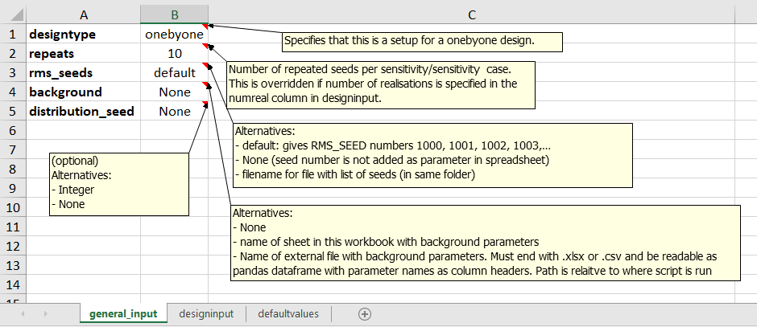

======================
Examples to learn from
======================

.. Notice that YAML files included are also input to testing
   and this secures consistency!

-------------------------------------------------
Create design matrix for one by one sensitivities
-------------------------------------------------
These examples show use of the ``fmu.tools.sensitivities`` package to generate design matrices automatically. Input is given as a dictionary which can be generated from an excel workbook. The excel workbook must be set up using a specific format. These examples explain how to set up the workbook.

Example1: Excel file for one by one sensitivities with repeating seeds
""""""""""""""""""""""""""""""""""""""""""""""""""""""""""""""""""""""
The excel workbook contains several sheets. The three sheets **general_input**, **designinput** and **defaultvalues** need to exist with these exact names in the input workbook.

The general_input sheet contains the *designtype*, which has to be set to onebyone. The parameter *repeats* tells how many seeds that should be repeated for each sensitivity. This is also the default number of realisations per sensitivity. In this first example *seeds* is set to *default* which means we will use seed numbers 1000, 1001, 1002, ... These seed numbers are repeated for each sensitivity/sensitivity case. *background* is set to *None* here, but is further explained in example 3.

In the **designinput** sheet, the parameters and values for each sensitivity are specified. See figure below.  We can here choose between four types of sensitivities:

seed
    This is normally the reference sensitivity to which all the others are compared to. All the parameters will be at their base case values taken from the defaultvalues sheet. Only the RMS_SEED will be varying.
scanario
    This is a sensitivity where the parameter(s) are set to their extreme values (high/low values) One or two cases can exist for each sensitivity. Each of the two cases must be given a name.
dist
    This is a monte carlo sensitivity where one or several parameters are sampled from the specified distribution(s). The distribution name is given in the *dist_name* column, and the distribution parameters are given in *dist_parm1*, *dist_param2*, *dist_param3*, *dist_param4*. Currently these distributions are implemented:
    
    * normal (mean, std dev)
    * normal (mean, std dev, min, max)  which is a truncated gaussian distribution
    * uniform (min,max)
    * loguniform (min,max)
    * triangular (min, mode, max)
    * discrete ((value1, value2, .. value_n),(weight1, weight2, .. weight_n))  which is a  discrete distribution with weights. If no weights are given a discrete uniform distribution will be used.
    * TO DO:
      
          * lognormal (mean(ln(X)), stddev(ln(X)))  Distribution parameters:  mean and std dev of the natural logarithm of the variable

In the example shown below four sensitivities are specified in addition to the seed sensitivity. In the *faults* sensitivity two alternative values for the parameter *fault_position* are specified, which will be compared to the seed sensitivity where the *fault_position* is set at its default value (0).  In the *velmodel* sensitivity only one alternative case is specified. In the *contacts* sensitivity three parameters are varied at the same time. In the *shallow* case, all contacts are set shallow, and opposite in the *deep* sensitiviy case.

The last sensitivity is a monte carlo sensitivity where the parameter *multz_ile* has values sampled from the distribution *loguniform(0.0001, 1)*. Note that for this last sensitivity the numbers of realisations *(numreal)* is set to 20, which overrides the default number of realisations given in the *general_input* spreadsheet. The seed numbers will for these 20 realisations be from 1000 to 1019.

.. image:: images/design_designinput.png

The **defaultvalues** sheet contains default values for the design. For parameters that also exist in the designinput sheet, the defaultvalues are used as 'base case value' in the deisgnmatrix. In addition all the parameters in the defaultvalues sheet will be written to the corresponding defaultvalues sheet in the output excel designmatrix workbook.
	   
.. image:: images/design_defaultvalues.png
	   
To generate the design matrix from this input use the *fmudesign* script (see Usage). Alternatively from a notebook:

.. code-block:: python

    from fmu.config import oyaml as yaml
    from fmu.tools.sensitivities import DesignMatrix, excel2dict_design

    with open('../input/config/design_input_example1.xlsx') as input_file:
        input_dict = excel2dict_design(input_file)

    design = DesignMatrix()
    design.generate(input_dict)
    # Writing design matrix to excel file
    design.to_xlsx('../input/distributions/design01.xlsx')

    
Example 2: Excel input for sensitivities with group of (correlated) parameters sampled from distributions
"""""""""""""""""""""""""""""""""""""""""""""""""""""""""""""""""""""""""""""""""""""""""""""""""""""""""
In this example the general_input is the same as for Example 1 but the designinput is a bit different. For sensitivity *sens6* there are several parameters sampled from different distributions. Note that for the *normal* and *lognormal* distributions the truncated versions will be used if *dist_param3* (min) and *dist_param4* (max) are specified in addition to *dist_param1* (mean) and *dist_param2* (standard deviation).

For sensitivity sens7 *corr1* is specified in the *corr_sheet* column. This means that the parameters for this sensitivity should be correlated, and the correlations are specified in the sheet with the same name. If there are several sensitivities with correlated parameters there can be several correlations sheets with different names.

Note also theat the integer value in the *decimals* columns specifies how many decimals that should be output in the design matrix for this parameter.

Sensitivity sens8 is defined to be read from an external file by providing a file path in the *extern_file* column. This needs to point to an excel spreadsheet with parameter names as column headers, and no row index.

.. image:: images/design_designinput2.png

The *corr1* sheet used for *sens7* looks like this:

.. image:: images/design_corr1.png
	   
Example 3: Excel input for sensitivities with background parameters
"""""""""""""""""""""""""""""""""""""""""""""""""""""""""""""""""""
In this example the one by one design is put on top of a set of *background parameters* randomly sampled from distributions. This means that in the set of realisations for each sensitivity it is not only the seed that is varied, but also the background parameters. However each sensitivity/sensitivity case uses the same list of seeds and the same set of sampled background parameters.

The use of background parameters is flagged in the general_input sheet by changing *background* from *None* to either a name of the sheet where the background parameters are specified, or a path to an excel file where the only/first sheet is specifying the background parameters. The specification of the background parameters is the same as for a monte carlo sensitivity:  distribution types, distribution parameters, and optionally decimals and correlation sheet. The background sheet is shown in the figure below.

.. image:: images/design_backgroundvalues.png

-----------------------------------------
Adding sets of tornado plots to webportal
-----------------------------------------
This example shows how sets of tornado plots from a single sensitivitiy run can be added to a webportal using yaml configuration files and the 'add_webviz_tornadoplot'.

Fossekall one-by-one sensitivities run with design matrix is further explained on FMU wiki portal.

Yaml file for tornado from rms volumes
""""""""""""""""""""""""""""""""""""""
In this example the volume result files have been exported to csv using geogrid_volume.ipl and results from different realisation have been aggregated to one file.

.. literalinclude:: ../tests/data/sensitivities/config/config_example_geovolume.yaml
    :language: yaml

Yaml file for aggregating rms volume files to one before tornado calculations
"""""""""""""""""""""""""""""""""""""""""""""""""""""""""""""""""""""""""""""
In this example the volume result files have been exported to csv using geogrid_volume.ipl, but the result files from different realisations must be aggregated to one file before tornado calculations are done.

.. literalinclude:: ../tests/data/sensitivities/config/config_example_geovolume_ensemble.yaml
    :language: yaml

Yaml file for tornado plots from eclipse volumes
""""""""""""""""""""""""""""""""""""""""""""""""
In this example the result file has already been created using CSV_EXPORT1, so there is no need to collect results from different realisations. We want to create tornado plots for FOPT (field oil production total) and FGPT (field gas production total) at end of history (Date = 2013-07-11).

.. literalinclude:: ../tests/data/sensitivities/config/config_example_eclipse.yaml
    :language: yaml

Python example using yaml input
"""""""""""""""""""""""""""""""

.. code-block:: python

    #!/usr/bin/env python
    # -*- coding: utf-8 -*-
    from fmu.tools.sensitivities import add_webviz_tornadoplots
    from webviz import Webviz
 
    html_foldername = './webviz_example'
    title = 'Fossekall'
 
    web = Webviz(title, theme='equinor')
    configpath = '../input/config/'
 
    # add different types of plots to webviz project in SubMenus
    add_webviz_tornadoplots(web, configpath +
                            'config_example_geovolume.yaml') 
    add_webviz_tornadoplots(web, configpath +
                            'config_example_eclipse.yaml')
 
    # Finally, write html
    web.write_html(html_foldername, overwrite=True, display=True)

----------------------------
Use parts in your own set up
----------------------------

If you want another design and setup than provided with 'add_webviz_tornadoplot'
you can use the functionallity in fmu.tools.sensitivity and make your own script.

Example: summary of design matrix
"""""""""""""""""""""""""""""""""
Use summarize_design on a design matrix on standard fmu format for one-by-one sensitivities to summarize the realisation numbers for each SENSNAME and SENSTYPE, and whether they are scalar sensitivities or monte carlo sensitivities.

.. code-block:: python

    #!/usr/bin/env python
    # -*- coding: utf-8 -*-
 
    from fmu.tools.sensitivities import summarize_design
 
    # Full or relative path to design matrix .xlsx or .csv format
    designname = '../tests/data/sensitivities/distributions/design.xlsx' 
    # Only include for excel files; name of sheet that contains design matrix
    designsheet = 'DesignSheet01' 
 
    designtable = summarize_design(designname, designsheet)
 
    # designtable is a pandas DataFrame with summary of the design in the designmatrix,
    # i.e. it will contain realisation number, senstype and senscase for each sensitivity

Example: calculating one tornadotable 
""""""""""""""""""""""""""""""""""""""
Using calc_tornadoplot with a 'designsummary' and a resultfile as input, and calculating statistics to visualize in a tornado plot for a given choice of SELECTOR (e.g. ZONE:'Ile') and RESPONSE (e.g. STOIIP_OIL). The reference is usually the mean of the realizations in the "seed sensitivity", but it can also be specified as a single realisation number, e.g. if you have a reference case in realization 0. Statistics showing the difference to the reference can be calculated as absolute values, or as percentages. You could also choose to exclude from the plot, sensitivities that are smaller than the seed sensitivity P10/P90.

.. code-block:: python

    #!/usr/bin/env python
    # -*- coding: utf-8 -*-
 
    import pandas as pd
    from fmu.tools.sensitivities import calc_tornadoplot
 
    designtable=pd.read_csv('designsummary.csv')
    results = pd.read_csv('resultfile.csv')
    response = 'STOIIP_OIL'
    selectors = ['ZONE', 'REGION'] # One or several in a list
    # One or several in a list of lists
    selection = [['Ile','Tofte'], ['SegmentA']] # Will sum Ile and Tofte volumes first
    reference = 'seed' # Alternatively a single realisation number
    scale = 'percentage' # Alterntively 'absolute'
 
    (tornadotable, ref_value) = calc_tornadoinput(
        designtable, results, response, selectors,
        selection, reference, scale)
 
    # Other options: specify cutbyseed = True and sortsens = False (see documentation).
    # tornadotable is a pandas DataFrame for visualisation of TornadoPlot in webviz
    # ref_value is the average of the reference, 
    # which can be useful to include in label/title in webviz
