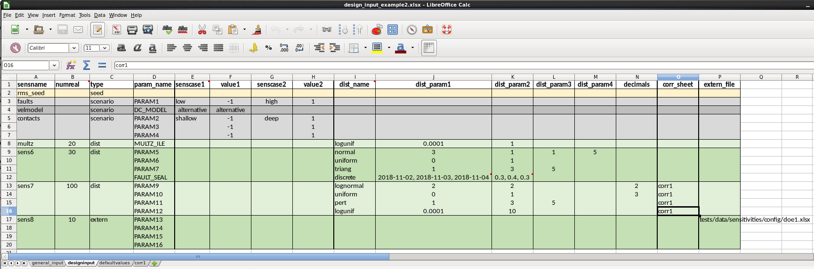
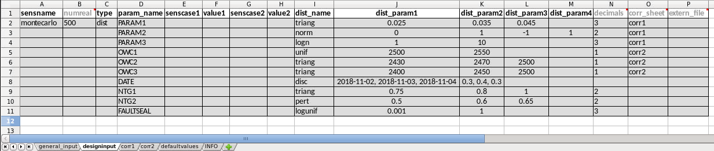

=================
FMU design matrix
=================

This page documents the CLI tool ``fmudesign``, which is used to generate design matrices for FMU.
For instance, it can be used to generate design matrices for DESIGN2PARAMS and DESIGN_KW in ERT.
Before you read further, here is a list of useful resources:

- The `source code <https://github.com/equinor/semeio>`_ for ``fmudesign``
- `FMU course docs <https://fmu-docs.equinor.com/docs/fmu-coursedocs/fmu-howto/sensitivities/index.html>`_
- You can run ``fmudesign --help`` to get help and to generate example files.

-----
Usage
-----

The code in ``fmudesign`` can be used in several scenarios:

* As part of an ERT workflow, typically as a pre- or postprocessing workflow used by HOOK_WORKFLOW PRE_SIMULATION (preprocessing) or POST_SIMULATION (postprocessing)
* Part of other scripts or utilities, either for analysis or preparation for visualization such as webviz.
* It can also be used interactively, e.g. in the (i)python interpreter or a Jupyter notebook.

**The CLI.**
You can generate a design matrix by running ``fmudesign`` from the terminal::

    fmudesign <design_input.xlsx> <output_matrix.xlsx>

To see more verbose information (descriptive statistics, plots, etc), run with ``--verbose`` or simply ``-v``::

    fmudesign <design_input.xlsx> <output_matrix.xlsx> --verbose

The ``--verbose`` argument can be repeated several times to increase verbosity of outputs.
Run ``fmudesign --help`` to see all available options.

**From Python.**
Instead of using the CLI, you can call the functions from Python directly.
The best approach is to read the `code <https://github.com/equinor/semeio>`_.

-------------------------------------------------
Create design matrix for one by one sensitivities
-------------------------------------------------

The examples below show how to use the ``semeio.fmudesign`` package to generate design matrices.
The input is a Python dictionary, which is read and parsed from an excel workbook.
The workbook must be set up using a specific format.

Sensitivities
"""""""""""""

The types of sensitivities that are available are:

seed
    This is normally the reference sensitivity other sensitivities are compared to.
    All parameters will be at their default values taken from the defaultvalues sheet.
    Only the RMS_SEED will vary.

    Some additional possibilities:

    * it is possible to have several sensitivities of type 'seed' in a set up, for instance looking at how RMS_SEED variation affects structure, how it affects facies or how it affects petrophysical modelling.
    * it is possible to set one or several parameters to another constant value than the default value by filling in parameter names, dist_name = const and dist_param1 = <value>.

scenario
    This is a sensitivity where parameter(s) are set to a constant values (high/low values).
    One or two scenario cases can exist for each sensitivity.
    Each of the two cases must be given a name.

dist
    A monte carlo sensitivity where parameters are sampled from distributions.
    The distribution name and distribution parameters are given as input.
    The following are implemented:

      * ``normal(mean, stddev, min=-inf, max=inf)``
         a Gaussian variable. use either 2 parameters or 4 parameters for a truncated version
      * ``uniform(min, max)``
         a uniform variable
      * ``loguniform(min, max)``
         a variable whose natural logarithm is uniformly distributed. min and max refer to the the output, not the logarithm.
      * ``triangular(min, mode, max)``
         a triangular variable parametrized by minimum value, mode and maximum value.
      * ``pert(min, mode, max, scale=4)``
         a PERT distribution (re-parametrized Beta). if a fourth parameter is given, it is the scale parameter (default is 4).
      * ``beta(a, b, min=0, max=1)``
         a beta variable. use either 2 parameters or 4 parameters for a more general version
      * ``discrete(value1, value2, ..., value_n), (weight1, weight2, ..., weight_n))``
         a weighted discrete distribution. If no weights are given, a discrete uniform distribution is used.
      * ``lognormal(mu, sigma, min=0, max=inf)``
         a variable whose logarithm has a normal distribution. arguments mu and sigma and the mean and stddev of the *logarithm* of the variable.
         If 4 parameters are given instead of 2, a truncated version is used. 
         The truncation limits min and max do NOT refer to the logarithm of the variable, but to the observed values.
      * ``const(value)``
         a constant variable. Used to set a parameter to a constant value to override the default value.
         Can be used also for sensitivities of type *seed*.

    The following P10 and P90 distributions are also implemented.
    With these distributions, the user provides P10 and P90 values instead of the typical arguments:

      * ``normal_p10_p90(p10, p90, min=-inf, max=inf)``
         a Gaussian variable. The user provides P10 and P90, and the mean and stddev are computed automatically.
         For instance, if a user provides P10=-2 and P90=3, then mean=0.5 and stddev=1.951 are computed.
         If 4 parameters are given, the final two are truncation parameters.
      * ``uniform_p10_p90(p10, p90)``
         a uniform variable, parametrized by P10 and P90.
      * ``triangular_p10_p90(p10, mode, p90)``
         a triangular variable parametrized by P10, mode and P90.
      * ``pert_p10_p90(p10, mode, p90, scale=4)``
         a PERT distribution with parametrized by P10, mode and P90.
         If a fourth parameter is given, it is the scale parameter (default is 4).
    
    The names are matched on case-insensitive prefixes: ``norm``, ``unif``, ``logunif``, ``triang``, ``pert``, ``beta``, ``disc``, ``logn`` and ``const``.
    For instance, ``norm``, ``normal``, ``normal``, and ``NORMAL_DISTRIBUTION`` will all match to a normal distribution.
    We recommend using the full name, not prefixes.
    Distribution parameters are filled in into the dist_param1, dist_param2 .. columns in the same order as above.

ref
    This creates a **single** realisation with parameter values set to default values.
    Typically used if no seed variation or background distributions are used, but a realisation with default values is needed as a reference for tornado calculations.
    Note that this realisation will **not** itself be plotted as a sensitivity in the tornadoplot.
    This is flagged by SENSCASE set to 'ref' in the output design matrix.

background
    Creates a set of realisations with parameter values set to default values except a set of background parameters that are varying, but have the same set of values in all sensitivities. 
    Typically used if no seed variation is included, but a sensitivity is needed as a reference for tornado calculations where only background parameters are varying, and all other parameters are at their default values.
    This sensitivity will be plotted as a sensitivity in the tornadoplot.
    This is flagged by SENSCASE set to 'p10_p90' in the output design matrix.
    The background parameters can either be generated from distributions or read from a xlsx file.

extern
    This type of sensitivity will read parameter values from an external file. Typically used when parameter values are created in another software. Specify in input which parameter names to read from the file.

Input configuration format
""""""""""""""""""""""""""

Three sheets must exist in the input Excel workbook:

* **general_input** 
* **designinput**
* **defaultvalues**

The default names can be changed using CLI arguments, see ``fmudesign run --help``.

Run ``fmudesign init --help`` to learn how to set up example workbooks.
In the example notebooks, all config options in the **general_input** sheet are documented.

Some of the **general_input** options are shown in the screenshot below:

.. image:: images/design_general_input.png

In the **designinput** sheet, the parameters and values or distributions for each sensitivity are specified.
See examples below.

The **defaultvalues** sheet contains default values for the design.
For parameters that also exist in the **designinput** sheet, the defaultvalues are used as 'base case value' in the design matrix.
In addition all the parameters in the **defaultvalues** sheet will be written to the corresponding **DefaultValues** sheet in the output workbook.

.. image:: images/design_defaultvalues.png

Optional additional sheets include:

* sheet(s) with correlation matrices for sensitivities where correlated random variables are used
* sheet defining background parameters and correlation sheet(s) for these

Example 1: One by one sensitivities with repeating RMS seeds
""""""""""""""""""""""""""""""""""""""""""""""""""""""""""""

.. note::
   The Excel config files that correspond to these examples can be created and run using ``fmudesign init``.
   That way you can follow along and run the files as you read through the examples!

In this example the *general_input* and *defaultvalues* are as in the figures above.
In the *designinput* sheet four sensitivities are specified in addition to the seed sensitivity: 'faults', 'velmodel', 'contacts' and 'multz'.
Each sensitivity can contain one or several rows with parameters, but the sensitivity type and senscase (names for the 1-2 cases per scenario) is defined in the first row of the sensitivity.
In the *faults* sensitivity two alternative values for the parameter *FAULT_POSITION* are specified, in senscase 'east' and 'west'.
Typically these will in tornado calculations be compared to the rms_seed sensitivity where the *FAULT_POSITION* will be set to its default value (0).
In the *velmodel* sensitivity only one alternative senscase is specified for the parameter *DC_MODEL*.
In the *contacts* sensitivity three parameters are varied at the same time.
In the *shallow* case, all contacts are set shallow, and opposite in the *deep* sensitiviy case.

The last sensitivity is a monte carlo sensitivity where the parameter *MULTZ_ILE* has values sampled from the distribution *loguniform(0.0001, 1)*. Note that for this last sensitivity the numbers of realisations *(numreal)* is set to 20, which overrides the default number of realisations given in the *general_input* spreadsheet. The RMS_SEED numbers will for these 20 realisations be from 1000 to 1019, since *rms_seeds* was set to *default* in the *general_input* sheet.

.. image:: images/design_designinput1.png

To generate the design matrix, use ``fmudesign`` as follows:

.. code-block:: console

    fmudesign <path_to_design_input_example1.xlsx> <path_to_output_design_matrix.xlsx>

Example 2: Excel input for sensitivities with group of (correlated) parameters sampled from distributions
"""""""""""""""""""""""""""""""""""""""""""""""""""""""""""""""""""""""""""""""""""""""""""""""""""""""""
In this example the *general_input* and *defaultvalues* are the same as for Example 1, but the designinput is different.
For sensitivity *sens6* there are parameters sampled from distributions.
For the *normal* distributions the truncated versions will be used if *dist_param3* (min) and *dist_param4* (max) are specified in addition to *dist_param1* (mean) and *dist_param2* (standard deviation).

For sensitivity *sens7* *corr1* is specified in the *corr_sheet* column.
This means that the parameters for this sensitivity should be correlated, and the correlations should be read from the sheet with the same name.
``fmudesign`` will try to achieve the desired (Pearson) correlation coefficient, and while it typically gets close there no guarantee that is is possibly to get arbitrarily close to any user specified correlation matrix.
If there are several groups of correlated parameters within a sensitivity, there can be several correlations sheets with different names.
Specify the name of the correlation sheet the parameter belongs to in the *corr_sheet* column.

The integer value in the *decimals* columns specifies how many decimals the parameter value should be rounded to before output in the design matrix.
Only used for sensitivities of type *dist*.
The *numreal* and *decimals* columns are optional.

Sensitivity *sens8* is defined to be read from an external file by providing a file path in the *extern_file* column.
This needs to point to an excel spreadsheet with parameter names as column headers, and no row index.
The *extern_file* column is optional if no sensitivities of type 'extern' are used.

The *corr1* sheet used for *sens7* looks like this.
Parameters of type ``const`` can not be correlated.

.. image:: images/design_corr1.png

Example 3: Testing different velocity models with uncertainty
"""""""""""""""""""""""""""""""""""""""""""""""""""""""""""""
This example shows a set-up for testing the effects of different velocity models run with structural uncertainty (Simulation mode) with HUM in RMS.
In the general_input tab *repeats* is set to 10 and *rms_seeds* is set to 'default', so that for each sensitivity 10 realisations with RMS seeds 1000, 1001, --, 1009 are created.

The reference sensitivity *rms_seed* is set up with COHIBA_MODE 'prediction', and VEL_MODEL (velocity model) number 1 read from *defaultvalues*.
So for this sensitivity the seed variation will only affect other jobs using RMS_SEED, such as facies/property modelling.

In the sensitivity *velmod1* COHIBA_MODE is set to 'simulation' which will control the HUM job to be run in simulation mode.
Velocity model is set to model number 1.
This explores the how the RMS seed variation affects the structure for velocity model 1.
Similarly the sensitivity *velmod2* will explore how the RMS seed variation affects the structure for velocity model 2.
Note that all these three first sensitivities are set up with *type* set to *seed* which flags that SENSCASE in the output design matrix should be set to *p10_p90* so that P10/P90 is calculated for the tornado plot.

The last sensitivity *vel_combined* explores the full velocity uncertainty by combining velocity model 1 and 2 in simulation mode, by sampling model 1 or 2 with 60/40 % probability, both run in simulation.
Here is defined that 30 realisations will be used for this sensitivity instead of the default number 10, from the general_input sheet.

.. image:: images/design_designinput_example_velocities.png

Example 4: Excel input for sensitivities with background parameters
"""""""""""""""""""""""""""""""""""""""""""""""""""""""""""""""""""

The use of background parameters is flagged in the general_input sheet by changing *background* from *None* to either a name of the sheet where the background parameters are specified, or a path to an excel file where the only/first sheet is specifying the background parameters.
If the external file contains less samples than number of realisations for a sensitivity, the rest will be filled with default values.
In this example it is specified that the background parameters should be generated from distributions as defined in the sheet (in the same workbook) called 'background'.
The specification is the same as for a sensitivity of type 'dist':  distribution types, distribution parameters, and optionally decimals and correlation sheet.
The background sheet for this example is shown in the figure below.

.. image:: images/design_background_geninput.png

.. image:: images/design_backgroundvalues.png

Example 5: Sensitivities with a single reference realisation
"""""""""""""""""""""""""""""""""""""""""""""""""""""""""""""
This type of set up might be used if one do not want to include any RMS seed variation or background parameters, but want to create a single realisation that can be used as reference for the tornado plot.
In the *general_input* sheet *rms_seeds* is set to *None*.
The first line in the *designinput* sheet is using *senstype* set to 'ref'.
This is flagging that it should take parameter values from the *defaultvalues* sheet, and that it will get *SENSCASE* set to 'ref' in the output design matrix.
This ensures it can only be used as a reference for tornado calculations, but will not itself plot as a sensitivity in the tornado plot.
The next three sensitivities in this example are scenario sensitivities with only one realisation (as there is no RMS seed variation), while the final one samples 10 values for MULTZ_ILE from a distribution.

.. image:: images/design_designinput_singlereference.png

Example 6: Sensitivities with a single reference realisation and seed sensitivity
"""""""""""""""""""""""""""""""""""""""""""""""""""""""""""""""""""""""""""""""""
It is also possible to set up a design matrix that includes *both* a single reference realisation and a seed sensitivity that can be used as reference for tornado plots.
In this example the single reference realisation will get the RMS_SEED value as specified in *defaultvalues*, while the other sensitivities will get the number of realisations and RMS_SEED values as specified in *general_input* tab.
This allows the user to later choose which reference (realisation 0 or the sensitivity called 'rms_seed') to use for the tornado plots.

.. image:: images/design_designinput_singlereference_and_seed.png

Example 7: Sensitivities with background but without RMS seed
"""""""""""""""""""""""""""""""""""""""""""""""""""""""""""""
This set up might be used if running a one by one design on top of varying background parameters, but the seed sensitivity is not included.
In this case there will be no 'seed' sensitivity to use as reference for tornado plot, so one need to generate a reference where only the background parameters are varying and the other parameters are set to their default values.
This is flagged by using the sensitivity type 'background' which do not take any additional parameters.
In the output design matrix this first sensitivity will have SENSNAME 'background' and SENSCASE 'p10_p90'. The background sensitivity is by default included in the tornado plot.

.. image:: images/design_designinput_background_noseed.png

Example 8: Full monte carlo sensitivity
"""""""""""""""""""""""""""""""""""""""
This example shows a full monte carlo design with correlated parameters.
This means all the parameters are randomly drawn from their distributions, and could have correlations as provided in the correlation sheet.
In this example there are two groups of correlated parameters, and their correlation matrices are specified in the sheets *corr1* and *corr2*.
The remaining parameters are not correlated.
In this case there is actually only one *sensname* as all the parameters belong to the same sensitivity.
The number of realisations can either be provided in the *general_input* sheet, or in the *numreal* column in the *designinput* sheet.
All parameters in the design must also be included in the *defaultvalues* sheet.

Example 9: Adding dependent discrete parameters to monte carlo designs
""""""""""""""""""""""""""""""""""""""""""""""""""""""""""""""""""""""
If parameter A is sampled from a discrete distribution, and one or more additional parameters is to be set based on the value of parameter A, this can be specified in a separate sheet, and sheetname added to the designinput sheet in an optional column called *dependencies*.
In this example the parameter LIFTCURVE_SINGLE is drawn from a weighted discrete distribution, while LIFTCURVE_DUAL and ANOTHER PARAMETER is set based on the value of LIFTCURVE_SINGLE.
Note that there cannot be  more than one "mother" parameter, and you cannot have more complicated dependencies like if statements, formulas or inequalities.
This solution is only provided for 100% correlated discrete parameters.

Example: summary of design matrix
"""""""""""""""""""""""""""""""""

Use ``summarize_design`` on a design matrix on standard FMU format for one-by-one sensitivities to summarize the realisation numbers for each SENSNAME and SENSTYPE, and whether they are scalar sensitivities or monte carlo sensitivities.

.. code-block:: python

    from semeio.fmudesign import summarize_design

    # Full or relative path to design matrix .xlsx or .csv format
    designname = '../tests/data/sensitivities/distributions/design.xlsx'

    # Only include for excel files; name of sheet that contains design matrix
    designsheet = 'DesignSheet01'

    # designtable is a pandas DataFrame with summary of the design in the designmatrix,
    # i.e. it will contain realisation number, senstype and senscase for each sensitivity
    designtable = summarize_design(designname, designsheet)
