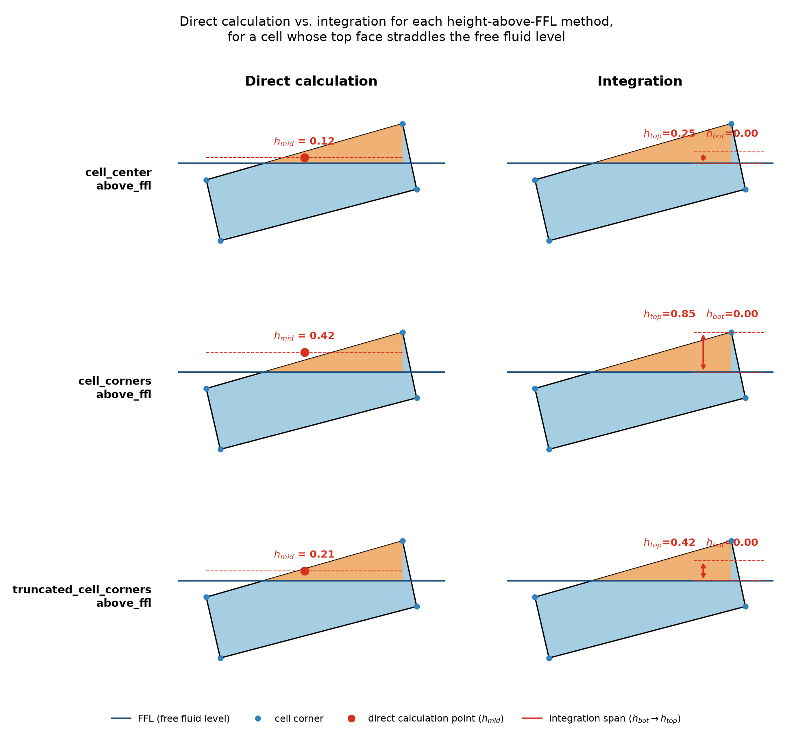
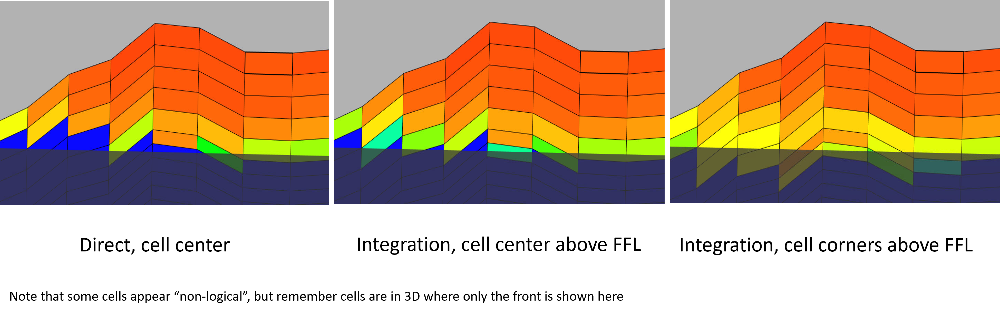

Water saturation theory
=======================

This page documents the theory behind :class:`fmu.tools.properties.SwFunction`.
It is based on the memo by Jan C. Rivenæs, dated 22 April 2024
(:download:`original PDF <pdf/sw_calc.pdf>`).

Introduction
------------

This note describes common formulations for saturation as a function of height
in reservoir models. For basic principles of capillary pressure, see standard
reservoir-engineering textbooks.

Normalized capillary pressure
~~~~~~~~~~~~~~~~~~~~~~~~~~~~~

The normalized capillary pressure is

.. math::

   P_{CN} = \frac{P_C}{\sigma \cos\theta}
           = \frac{(\rho_w-\rho_{hc})gh}{\sigma\cos\theta}
           = \frac{\Delta\rho\,g\,h}{\gamma_{hc}},

where :math:`\gamma_{hc}` is the adhesion tension. Using fluid gradients
:math:`\varrho=\rho g` instead of density and gravity gives

.. math::

   P_{CN} = \frac{\Delta\varrho\,h}{\gamma},
   \qquad h = FFL - TVD.

This is normally evaluated only for :math:`h \geq 0`. In an oil-water-gas
system, the oil leg is

.. math::

   P_{CN,o} = \frac{\Delta\varrho_{wo}\,h}{\gamma_{wo}},
   \qquad h = FWL - TVD,

while the gas leg includes the contribution from the oil leg:

.. math::

   P_{CN,g} =
   \frac{\Delta\varrho_{wo}\,H_o}{\gamma_{wo}}
   + \frac{\Delta\varrho_{wg}\,h}{\gamma_{wg}},

where :math:`H_o` is constant and

.. math::

   H_o = FWL - FOL,
   \qquad h = FOL - TVD.

Thus, for a given three-dimensional cell,

.. math::

   P_{CN,g} = M + \frac{\Delta\varrho_{wg}\,h}{\gamma_{wg}},

where :math:`M` is constant.

Normalization
~~~~~~~~~~~~~

In some cases, minimum and maximum saturations are relevant. In particular,
the minimum value :math:`S_{wir,a}` can be applied as an asymptote. It must not
be confused with :math:`S_{wirr}` (the minimum saturation, SWL) used in
reservoir simulation studies:

.. math::

   S_{w,\mathrm{final}} =
   S_{wir,a} + (S_{w,\max}-S_{wir,a})S_w.

The normalized :math:`S_w` is the quantity computed by the formulations below;
the final scaling is applied afterwards.

The Leverett J formulation
--------------------------

The Leverett J formulation is commonly written as

.. math::

   S_w = A J^B.

It can also be written in inverse form:

.. math::

   S_w = \left(\frac{J}{\hat{A}}\right)^{1/\hat{B}}.

The parameter conversions are

.. math::

   A = \left(\frac{1}{\hat{A}}\right)^{1/\hat{B}},
   \qquad B = \frac{1}{\hat{B}}.

The simplified (log-based) J is

.. math::

   J = h\sqrt{\frac{k}{\phi}},

where :math:`h` is the height term, and :math:`k` and :math:`\phi` are
permeability and porosity. The permeability need not be dynamic flow
permeability; it may be a local permeability or a value derived from porosity.

The full (core-based) J is

.. math::

   J =
   \frac{\bar{C}(\rho_w-\rho_{hc})gh}{\sigma\cos\theta}
   \sqrt{\frac{k}{\phi}}
   =
   \frac{\bar{C}(\varrho_w-\varrho_{hc})h}{\gamma}
   \sqrt{\frac{k}{\phi}}.

Using the definition of normalized capillary pressure:

.. math::

   J = \bar{C}P_{CN}\sqrt{\frac{k}{\phi}}.

For the oil leg this gives

.. math::

   S_{w,o} =
   A\left(
   \frac{\bar{C}\Delta\varrho_{wo}h}{\gamma_{wo}}
   \right)^B
   \sqrt{\frac{k}{\phi}}^{\,B}.

For the gas leg:

.. math::

   S_{w,g} =
   A\left(
   \frac{\bar{C}\Delta\varrho_{wo}H_o}{\gamma_{wo}}
   + \frac{\bar{C}\Delta\varrho_{wg}h}{\gamma_{wg}}
   \right)^B
   \sqrt{\frac{k}{\phi}}^{\,B}.

The generic expression used by the implementation is

.. math::
   :label: sw-generic

   S_w = a(m+xh)^b.

For full Leverett J with normalized capillary pressures:

.. math::

   \begin{aligned}
   a &= A, \qquad b = B,\\
   m &= 0 \text{ (oil), or }
       \frac{\bar{C}\Delta\varrho_{wo}H_o}{\gamma_{wo}}
       \sqrt{\frac{k}{\phi}} \text{ (gas)},\\
   x &= \bar{C}\frac{\Delta\varrho_{w,hc}}{\gamma_{w,hc}}
       \sqrt{\frac{k}{\phi}}.
   \end{aligned}

For simplified Leverett J:

.. math::

   a=A,\qquad b=B,\qquad m=0,\qquad x=\sqrt{\frac{k}{\phi}}.

The BVW formulation
--------------------

The bulk-volume-water (BVW) formulation can be written as

.. math::

   S_w = A P^B\phi^C,

where :math:`A`, :math:`B` and :math:`C` are constants per cell. For example:

.. math::

   A=a_1\phi+a_2,\qquad
   B=b_1\phi+b_2,\qquad
   C=c_1\phi+c_2.

In many cases :math:`P` is normalized capillary pressure:

.. math::

   P_{CN} =
   \frac{(\varrho_w-\varrho_{hc})h}{\gamma_{hc,w}}
   = \frac{\Delta\varrho\,h}{\gamma}.

The formulation can then be rearranged into the same generic expression as
:eq:`sw-generic`:

.. math::

   S_w=a(xh)^b.

For an oil-water-gas system, the constant oil contribution gives

.. math::

   S_w=a(m+xh)^b,

where

.. math::

   a=A\phi^C,\qquad b=B,

and

.. math::

   m=0 \text{ (oil), or }
   \frac{\Delta\varrho_{wo}H_o}{\gamma_{wo}}
   \text{ (gas with oil below)},\qquad
   x=\frac{\Delta\varrho_{w,hc}}{\gamma_{w,hc}}.

The Brooks-Corey formulation
----------------------------

One form of the Brooks-Corey equation is

.. math::

   S_{w,\mathrm{final}} =
   S_{wi}+(1-S_{wi})
   \left(\frac{P_{CN,e}}{P_{CN}}\right)^{1/N}.

The normalized saturation is therefore

.. math::

   S_w =
   \left(\frac{P_{CN,e}}{P_{CN}}\right)^{1/N}
   = P_{CN,e}^{1/N}P_{CN}^{-1/N}.

Here:

* :math:`S_{w,\mathrm{final}}` is the resulting saturation.
* :math:`S_w` is the normalized saturation.
* :math:`S_{wi}` is irreducible water saturation, constant or a function of
  porosity.
* :math:`P_{CN,e}` is entry normalized capillary pressure, constant or a
  function of porosity.
* :math:`P_{CN}` is normalized capillary pressure.
* :math:`N` is the Corey exponent, constant or a function of porosity.

Example parameterizations are

.. math::

   S_{wi}=a_1\phi+a_2,\qquad
   P_{CN,e}=b_1\phi^{b_2},\qquad
   N=c_1\phi+c_2.

By reformulation, this also has the generic form :eq:`sw-generic`:

.. math::

   S_w=a(m+xh)^b,

where

.. math::

   h = \text{height above the free-fluid level},\qquad
   a=P_{CN,e}^{1/N},\qquad
   b=-\frac{1}{N},

and

.. math::

   m=0 \text{ (oil), or }
   \frac{\Delta\varrho_{wo}H_o}{\gamma_{wo}}
   \text{ (gas with oil below)},\qquad
   x=\frac{\varrho_w-\varrho_{hc}}{\gamma_{hc,w}}.

Integration of the height function
----------------------------------

For efficient work with three-dimensional models, thick cells should be
supported. Evaluating the function only at the cell centre can be inaccurate
when saturation varies significantly across a cell. There are two alternatives:

1. Refine the model vertically to approximate numerical integration.
2. Integrate the saturation function analytically.

Vertical refinement increases computation time and can reduce graphical
performance, so analytical integration is preferable. For the generic function
:eq:`sw-generic`:

.. math::

   \begin{aligned}
   \int S_w\,dh
   &= \int a(m+xh)^b\,dh\\
   &= \frac{a}{x(b+1)}(m+xh)^{b+1}.
   \end{aligned}

For a cell with total height :math:`\Delta H`, an integrated saturation can be
expressed as

.. math::

   S_w =
   \frac{1}{\Delta H}\left[
   H_T+\frac{a}{x(b+1)}
   \left((m+xH_2)^{b+1}-(m+xH_1^*)^{b+1}\right)
   \right].

Determining threshold height
~~~~~~~~~~~~~~~~~~~~~~~~~~~~

The threshold height is found from :math:`S_w=1`:

.. math::

   a(m+xH_T)^b=1.

Thus

.. math::

   H_T=\frac{(1/a)^{1/b}-m}{x}.

This height is independent of the :math:`S_{wir,a}` and :math:`S_{w,\max}`
scaling. The values :math:`H_2` and :math:`H_1^*` can be computed in different
ways depending on the contact position. :math:`H_1^*` may be the threshold
height or the cell base.

Geometrical considerations
--------------------------

When finding a cell centre or the cell base/top for integration, several
geometrical choices are possible. The choice depends on whether the direct
method or integration is used, and on how a cell that straddles the free
fluid level is handled. The ``method`` argument to
:class:`fmu.tools.properties.SwFunction` (implemented via
``xtgeo.Grid.get_heights_above_ffl``) supports three
options:

* ``cell_center_above_ffl`` averages the raw, untruncated corner heights for
  the top face (and separately for the bottom face), then clips the whole
  cell's resulting height to zero if negative. A corner far below the FFL can
  therefore pull the average down before the final clip is applied.
* ``cell_corners_above_ffl`` uses only the single shallowest top corner (and
  the single deepest bottom corner), ignoring the other corners entirely.
  This gives the largest possible height above FFL and, in general, the best
  volumetric accuracy when integrating.
* ``truncated_cell_corners_above_ffl`` computes the height above FFL
  independently for each of the four top corners (and each of the four bottom
  corners), truncates any corner found below the FFL to zero, and then
  averages the four (truncated) values. This sits between the two other
  methods: it accounts for all four corners like ``cell_center_above_ffl``,
  but truncating before averaging prevents corners far below the FFL from
  pulling the result down as much as the untruncated average does.

For any of the three methods, the resulting ``hcenter``, ``htop`` and
``hbot`` grid properties can be consumed in two ways by
:class:`fmu.tools.properties.SwFunction`: directly, by evaluating the
saturation function once at ``hcenter``, or by analytical integration
between ``hbot`` and ``htop`` (see `Integration of the height function`_
above).

       the three height-above-FFL methods, including truncated cell corners
   :align: center
   :width: 100%

   Direct calculation (using ``hmid``) versus integration (using ``htop``
   and ``hbot``) for each of the three ``method`` options, for a cell whose
   top face straddles the free fluid level. The effective height above FFL
   grows from ``cell_center_above_ffl`` (smallest), through
   ``truncated_cell_corners_above_ffl`` (intermediate), to
   ``cell_corners_above_ffl`` (largest).

   Examples from different settings.
